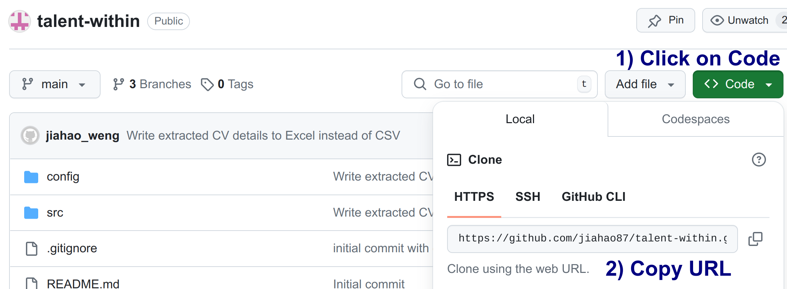
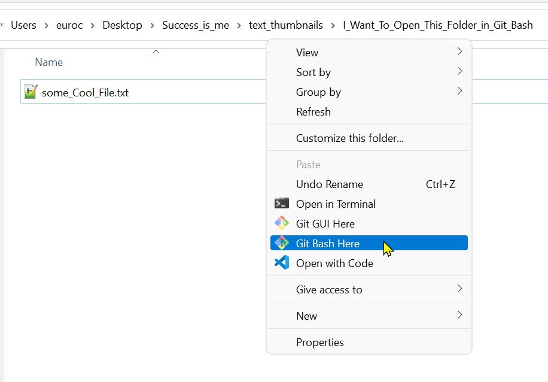
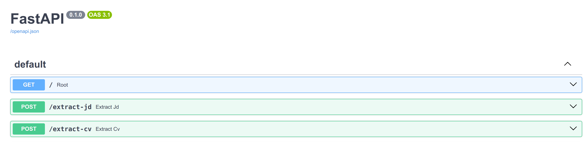

# Talent Within

"Talent Within" is a generative AI tool for internal talent management. Designed to optimize and elevate internal mobility within organizations, "Talent Within" leverages the power of AI to match employees' Knowledge, Skills, and Abilities (KSA) with internal opportunities.

## Getting Started

### Pre-requisites
1. Python
* Install [Miniconda](https://docs.anaconda.com/miniconda/miniconda-install/), which is a free, lightweight installer for Python
2. Git
* Install [Git](https://git-scm.com/book/en/v2/Getting-Started-Installing-Git) which is a version control system (VCS) that tracks changes to computer files, especially source code, during software development
3. Java

 By  Vikas : - 
 
 1) Download JDK  from https://www.azul.com/downloads/?package=jdk#zulu
            Version : 17.0.11+9  for Windows platform.
            17.0.11+9
            Azul Zulu: 17.50.19

  2) download the code from https://github.com/jiahao87/talent-within   (master branch)
  
  3) download the Intellij IDE Community version (2024.1.4) https://www.jetbrains.com/idea/download/?fromIDE=&section=windows
  
  4) download the postman https://www.postman.com/downloads/
  
  5) download the apache maven version : 3.9.8 for windows from https://maven.apache.org/download.cgi?.

    Maven set up :
      From IntelliJ IDE :  File - >setting-> Build, Execution,Deployment->Build Tools-> Maven
      User Setting file = Give your maven settings.xml
      Local Repository = Create Maven Repo directory and give path.
   
   

### Steps to Run Application
1. Git clone repository to local environment
* Visit [GitHub page](https://github.com/jiahao87/talent-within/tree/main) and copy repository URL from GitHub (Note: If repository has already been cloned, refer to section below on steps to update existing repository)<break>


2. In your local environment, navigate to a folder that you would like to copy the code repository to, perform a right mouse click and click on "Git Bash Here" <break>


3. In the Git Bash terminal, execute the command below, where the URL after "git clone" is the URL copied in step 1 
```
git clone https://github.com/jiahao87/talent-within.git
```

4. In the Git Bash terminal, change directory to the cloned repository by executing:
```
cd talent-within
```

5. Create a Python environment by executing in your Git Bash terminal:
```
conda env create -f environment.yml
```

6. Activate the environment created by executing in your Git Bash terminal:
```
conda activate talent-within
```

7. Copy additional repository files from [Google Drive](https://drive.google.com/drive/folders/17RHQ4tX2xV9DgbceeQNdg3YUgDlzzMyl?usp=sharing) to your local cloned repository folder

8. In the same Git Bash terminal as step 6, execute the commands below to start the Python API
```
cd src
python talent_api.py
``` 
Upon success, you may visit ```http://0.0.0.0:8502/doc``` to view the FastAPI documentation page, where you can try out the API endpoints.


### Steps to Update Local Repository

If you have already cloned the repository to your local environment, you can update your local repository by performing the command in Git Bash terminal:
```
git pull origin main
```

## Steps to Push Code to GitHub
1. Continuing from step 4 of "Getting Started", execute the following command to create a new branch, replacing "your branch name" with a suitable name of your own.
```
git checkout -b <your branch name>
``` 

2. Add your new code to the repository

3. Commit your new code locally by executing the following commands:
```
git add -A
git commit -m "<fill in short description about your new code>"
```

4. Push your new code to GitHub
```
git push -u origin <your branch name>
```

Note: Please refer to this [link](https://subscription.packtpub.com/book/cloud-and-networking/9781783986842/2/ch02lvl1sec22/cloning-your-repository-and-pushing-code-to-it) for further explanation on how to push code to GitHub.


POST http://localhost:8080/integrationservice/jd-upload
in postman ->  body ->form-data
file = file to be uploaded


POST http://localhost:8080/integrationservice/jd-submit

{
    "job_id": "899",
    "job_title": "Lead Support Analyst",
    "corporate_title": "Analyst",
    "country": "Singapore",
     "hiring_manager": "Datta Ghuge",
    "job_description": "The Lead Support Analyst is responsible for providing daily application and system support to the International Wealth Management Division (IWM), managing production incidents, liaising with users, and coordinating with internal teams and vendors on system upgrades, release management, and change implementation. They will also participate in business continuity planning and support regional and global projects.",
 "ksa": [
        "min 3 years of experience",
        "Supporting Wealth Management system",
        "Supporting Order Management system",
        "Supporting Execution Management System",
        "Database query including Oracle 19c and MSSQL",
        "UNIX and Windows operating environments",
        "Avaloq Certification",
        "ITIL v3 or similar qualifications",
        "Market data and financial models",
        "FIX protocol",
        "Cloud operations",
        "Microservices",
        "Python",
        "Perl",
        "Excel",
        "Communication",
        "Multitasking",
        "Prioritization under pressure",
        "Analytical",
        "Problem solving",
        "Willingness to learn",
        "Ability to adapt to different technologies",
        "Self-motivated",
        "Responsible",
        "Reliable team player",
        "Financial understanding in FX/MM/Equity/Derivatives",
        "Front to back operational workflow",
        "Avaloq Banking System",
        "English",
        "Mandarin",
        "Cantonese"
    ],
 "ksa_reviewed": [
        "min 3 years of experience",
        "Supporting Wealth Management system",
        "Supporting Order Management system",
        "Supporting Execution Management System",
        "Database query including Oracle 19c and MSSQL",
        "UNIX and Windows operating environments",
        "Avaloq Certification",
        "ITIL v3 or similar qualifications",
        "Market data and financial models"
       
    ],
    "education": "University graduate",
    "years_of_experience": "3",
    "technical_skill": [
        "Solid experience in supporting Wealth Management system/ Order Management system/ Execution Management System",
        "Strong knowledge and skills in database query including Oracle 19c and MSSQL",
        "Good knowledge in UNIX and Windows operating environments",
        "Completed Avaloq Certification training",
        "ITIL v3 or similar qualifications",
        "Knowledge of market data and financial models",
        "Practical understanding of FIX protocol",
        "Understanding on cloud operations, microservices, python/perl and excel skill"
    ],
    "non_technical_skill": [
        "Excellent communication skills in English at all levels with the ability to present information in a professional and mature manner",
        "Ability to multi-task and prioritize under pressure",
        "Excellent analytical and problem solving skills",
        "Willing to learn and able to adapt to different technologies",
        "Self-motivated, responsible and reliable team player"
    ],
    "domain_knowledge": [
        "Demonstrate basic financial understanding in FX/MM/Equity/Derivatives and associated front to back operational workflow",
        "Good knowledge of Avaloq Banking System"
    ],
    "language": [
        "English",
        "Mandarin",
        "Cantonese"
    ],
    "filepath": "../data/JD/JD20Jul.pdf"    
}


GET http://localhost:8080/integrationservice/jd-list
GET http://localhost:8080/integrationservice/talent-results     RequestParam = job-id=899
GET http://localhost:8080/integrationservice/candidate-info     RequestParam = employee-id=159616

